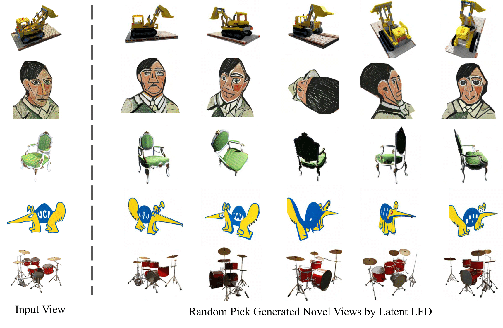

I'm a fifth-year undergraduate student at [University of California, Irvine](https://uci.edu/), double major in [Computer Science](https://cs.ics.uci.edu/) and [Mathematics](https://www.math.uci.edu/). My research interest includes generative models and 3D vision. I am very fortunate to be advised by [Prof. Xiaohui Xie](https://ics.uci.edu/~xhx/).

You can find my CV here: [Yifeng's Curriculum Vitate](../assets/CV.pdf)

[Email](yifengx4@uci.edu) / [Github](https://github.com/Yuukino22) / [Google Scholar](https://scholar.google.com/citations?user=GP8K3jAAAAAJ&hl=en)

Recent News
======
- \[Sep 2023\] I completed the ICS Honors Program!
- \[Jun 2023\] MedGen3D is accepted to MICCAI 2023!

Publications and Preprints
======

  

    
  

  

    <strong>Light Field Diffusion for Single-View Novel View Synthesis</strong> 
    <a href="https://yuukino22.github.io/">Yifeng Xiong</a>, <a href="https://ics.uci.edu/~haoyum3">Haoyu Ma</a>, <a href="https://scholar.google.com/citations?user=c6wKvwgAAAAJ&hl=en">Shanlin Sun</a>, <a href="https://scholar.google.com/citations?user=GdIW8DUAAAAJ&hl=en">Kun Han</a>, <a href="https://scholar.google.com/citations?user=2X3D1-4AAAAJ&hl=en">Hao Tang</a>, <a href="https://ics.uci.edu/~xhx/">Xiaohui Xie</a> 
    <em>arxiv, 2023</em> 
    <a href="https://lightfielddiffusion.github.io/">Webpage</a> / <a href="[URL_TO_PAPER](https://arxiv.org/abs/2309.11525)">Paper Link</a> / <a href="https://lightfielddiffusion.github.io/">Code</a>
  

Website Source
------
More info about configuring academicpages can be found in [the guide](https://academicpages.github.io/markdown/). The [guides for the Minimal Mistakes theme](https://mmistakes.github.io/minimal-mistakes/docs/configuration/) (which this theme was forked from) might also be helpful.
